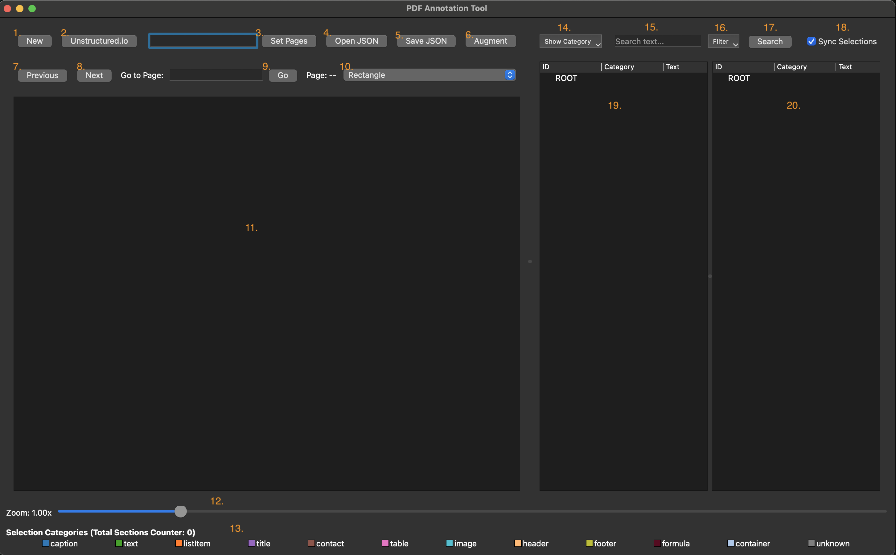
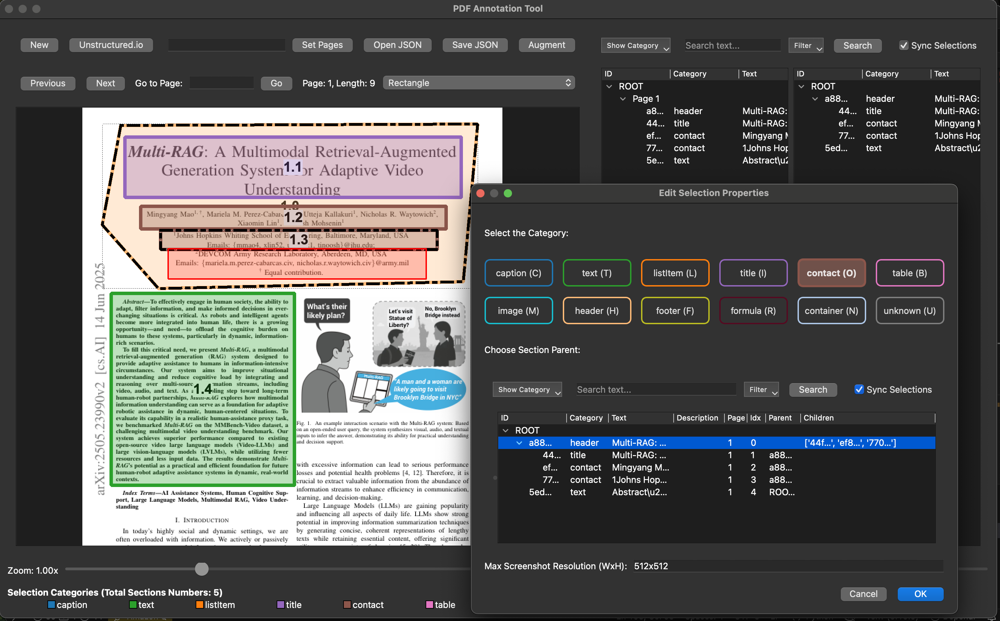
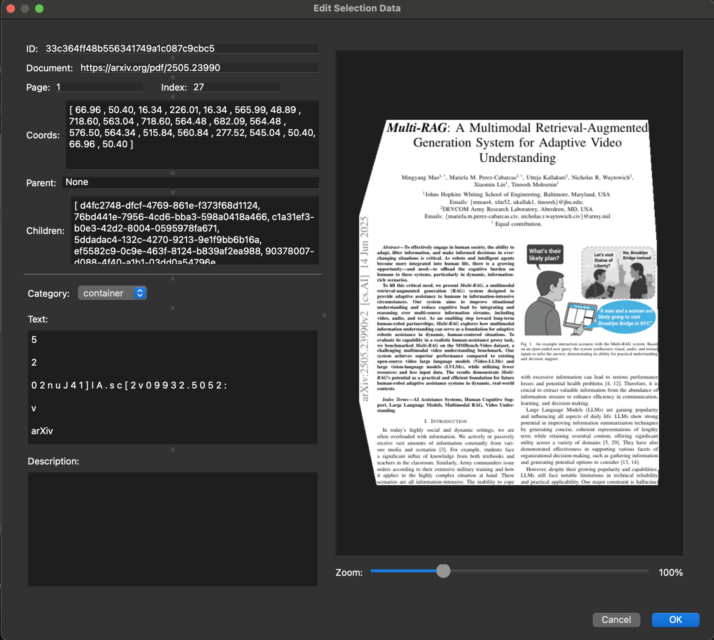
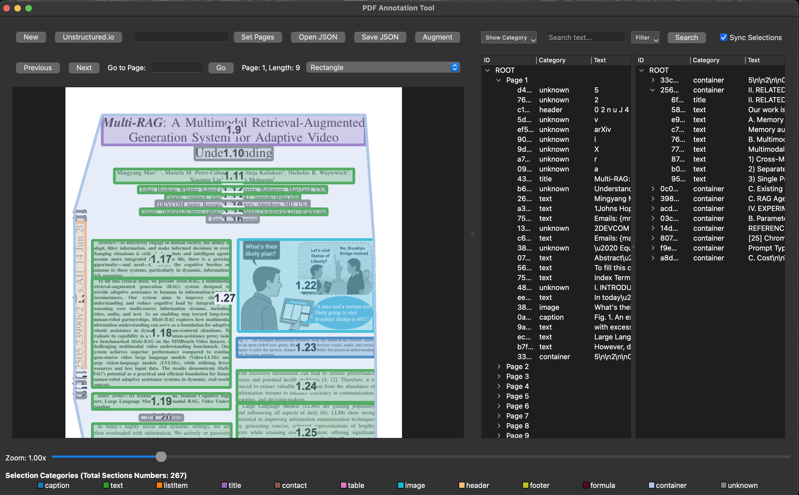
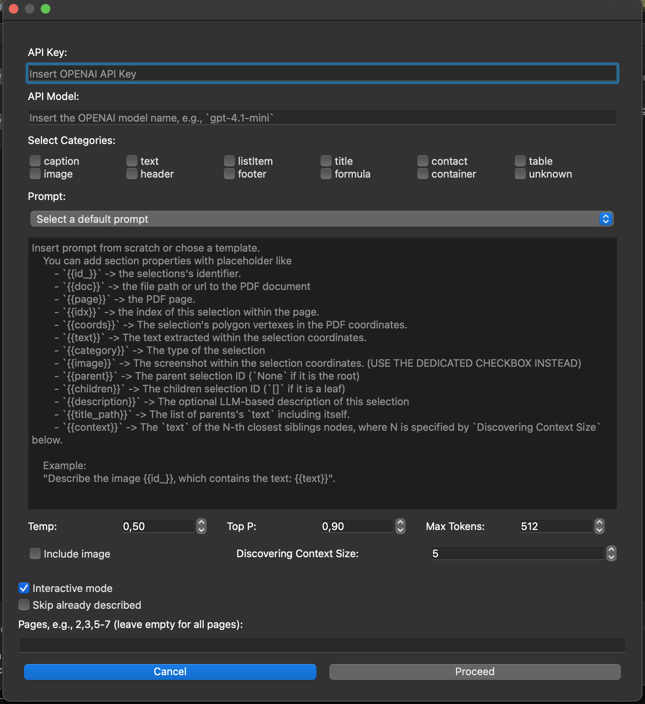
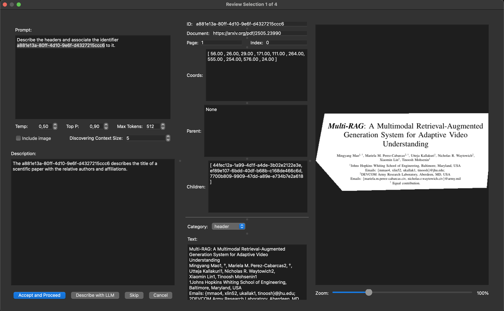

# PDF Annotation Tool


A GUI to select and annotate PDF areas with the help of the Unstructured API and 
ChatGPT.

This GUI is intended to be used to visually annotate a PDF and create data 
structured for use in Retrieval Augmented Generation (RAG) applications.  
In particular, it has been created with the following workflow in mind:

1. Open a PDF file (from a local source or a URL).
2. Use the [Unstructured API](https://docs.unstructured.io/open-source/core-functionality/partitioning#partition-pdf) 
   to partition the PDF into areas (e.g., titles, text, images, tables, captions, 
   etc.).
3. Visually inspect and refine the PDF areas and their metadata (e.g., category, 
   description, screenshot, etc.) through this GUI.
4. Use ChatGPT (through [LangChain](https://docs.langchain.com/oss/python/langchain/overview)) 
   to augment the metadata of specific PDF areas (e.g., describe images and tables).
5. Export the data associated with the selected PDF areas into a JSON file, which 
   can be further processed and encoded in a vector database for RAG applications.
6. Eventually, after testing the RAG application, go back to step 3 and refine the 
   PDF areas and their metadata.

The GUI is based on Qt5 and Python 3. It is stable, but its performance has 
significant room for improvement.


## GUI Abilities

This implements a GUI that can:
 - Open a PDF (from file or URL).
 - Select rectangular or polygonal areas in the PDF.
 - Associate and modify, for each selected area:
   - a `category` label (e.g., title, text, image, table, caption, etc.).
   - a text `description` (e.g., copy-paste from the PDF is automatically performed, 
     and `base64` encoding is used for images).
   - a PDF `screenshot`.
   - other metadata related to the document (e.g., `page` number, etc.).
 - Review and refine the metadata associated with PDF areas (the GUI supports an 
   undo operation; beta feature available with `ctrl+z`).
 - Format the PDF areas in a tree-like data structure.
 - Serialize the data associated with selected PDF areas into a JSON file.

The GUI also allows you to:
 1. Use the [Unstructured API](https://docs.unstructured.io/open-source/core-functionality/partitioning#partition-pdf) 
    to build a tree of selected PDF areas. Note that this GUI allows for visual 
    inspection and refinement of Unstructured API outcomes.
 2. Invoke ChatGPT (through [Lang Chain](https://docs.langchain.com/oss/python/langchain/overview)) 
    and ask it to describe images and tables. Note that GPT outcomes can be 
    validated by the user through this GUI.


## GUI Screenshots and Features


#### Main View Components

See the main view (in the screenshot below), where the buttons and view are meant to:
 [**1**]. Open a new project by setting its configuration and the relative PDF file.
 [**2**]. Use the Unstructured API to automatically select PDF areas. This button 
          allows serializing Unstructured API results as well as loading them back 
          into the project.
 [**3**]. Select the PDF pages to be considered, which can be specified as single 
          pages or ranges of pages (e.g., `1, 2, 10-15, 3, 310-311`). If empty, all 
          PDF pages will be considered.
 [**4**]. Open the JSON representation of the data partitioned from the PDF in a 
          previous usage of the GUI.
 [**5**]. Save the current JSON representation of the data partitioned from the PDF.
 [**6**]. Configure and invoke ChatGPT for augmenting PDF selections with some 
          descriptions.
 [**7**]. Navigate to the previous PDF page.
 [**8**]. Navigate to the next PDF page.
 [**9**]. Go to a specific PDF page (e.g., `11`), which is shown in the relative 
          label.
 [**10**]. Choose the type of a new PDF area to be set (i.e., rectangular or 
           polygonal).
 [**11**]. The view where the PDF and its areas are shown.
 [**12**]. The zoom level of the PDF.
 [**13**]. The legend of the categories assigned to PDF areas.
 [**14**]. Select the category areas to show in the 19-th and 20-th views.
 [**15**]. Type the text used to search for specific areas to be shown in the 19-th 
           and 20-th views.
 [**16**]. Choose the type of metadata to use for searching.
 [**17**]. Perform PDF area searching based on the 15-th and 16-th elements.
 [**18**]. Enable making elements selected in the 19-th view be highlighted also in 
           the 20-th view, and vice versa.
 [**19**]. The view of selected PDF areas as they will be stored in the output JSON 
           file.
 [**20**]. The view of selected PDF areas structured as a tree.




#### Project Opening and Loading

Use [**1**] to create a new project or load the data of a previous project by means 
of this [dialog](resources/GUI_example_screenshots/1_open.png). Such data encompass:
 - a project name,
 - a working directory,
 - a PDF, given as a file path or a WEB URL,
 - a JSON file, which contains the GUI outcomes, i.e., PDF partitions with relative 
   data. You can specify different input and output JSON files for loading some data 
   and saving it without overwriting its contents,
 - choose whether screenshots related to PDF areas should be saved as images, whose 
    names will be the area `ID`,
 - choose whether a JSON file should be automatically saved each time a new PDF page 
   is displayed.

After this step, the PDF will be displayed in the [**11**] view, as shown in this 
[screenshot](resources/GUI_example_screenshots/2_opened.png).


#### PDF Areas Creations

By clicking with the left mouse button, you can draw areas in the PDF, which will be 
used to partition data. Areas can be rectangular or polygonal (in this case, you 
should double-click to close the polygon). Every time a PDF area is selected, this 
dialog will appear:



This dialog requires setting some metadata for the new area, while other metadata 
are automatically computed by the GUI. In particular, it requires setting:
 - the `category` label of the new area (e.g., title, text, image, table, caption, 
   etc.),
 - the *parent* of the new area within the tree of all areas. Note that, by default, 
   the parent of the last area added with the `Title` or `Container` category will 
   be selected. Also, it is possible to filter areas shown in the tree as done in 
   the main view above (i.e., see [**14**], [**15**], [**16**], [**17**], [**18**]).

The area that is currently being created is highlighted in red over the PDF. Then, 
the newly created area will be shown in the PDF view [**11**] with a color based on 
its `category` (as shown in the legend [**13**]).


#### Selected Areas Modification and Inspection

Note that it is possible to select existing areas by clicking on them with the right 
mouse button. If an area is below another area, then you can double-click to rotate 
through the different areas. A black dashed line is used to show which area is 
currently selected.
In addition, an area can be selected through the trees shown in views [**19**] and 
[**20**].

By clicking with the left mouse button on a selected area (both in the PDF or tree 
views), a menu of options will appear (as shown in this [screenshot](resources/GUI_example_screenshots/4_selection_operation.png)), 
which allows you to:
 - find an area selected over the PDF in the trees, and vice versa,
 - delete the area,
 - move the area up or down in the data structure that will be serialized in the 
   output JSON file. Note that, in the tree structure, you can *drag-and-drop* areas 
   to change their position within the trees,
 - redraw the region in the PDF and reassign the metadata of an already created area,
 - view the metadata assigned to that specific area, and change some of its values, 
   as shown in the screenshot below.



The screenshot above shows the metadata associated with each PDF area, which 
encompass non-modifiable fields such as:
 - the `ID` of the area,
 - the path to the PDF `document`,
 - the `page` number,
 - the `index` of the area within the page,
 - the `coordinates` of the area within the PDF page (coordinates are in PDF units, 
   where the origin is at the top-left corner of the page with the y-axis pointing 
   down),
 - the `parent` area ID (`None` indicates that the area is a root area),
 - the `screenshot` of the area (which can be saved as image files if specified when 
   opening the project).

The modifiable fields are:
 - the `category` label of the area (e.g., title, text, image, table, caption, etc.),
 - the `text` associated with the area (which is automatically copy-pasted from the 
   PDF),
 - the `description` of the area (which can be modified manually or by means of 
   ChatGPT, as shown below).


#### Create PDF Areas with Unstructured API

By clicking on the [**2**] button, you can use the Unstructured API to automatically 
partition the PDF into areas. This will open this [dialog](resources/GUI_example_screenshots/6_unstructured_partitioning.png), 
which allows you to create a new PDF partition or load it from a file.

An example of PDF partitions automatically created with the Unstructured API is 
shown below:



Note that this GUI can be used to refine Unstructured API outcomes by modifying, 
deleting, arranging, and adding new areas (and related metadata), as shown above. 
However, this GUI will store PDF areas in a different data structure with respect to 
the Unstructured API, even if all metadata assigned to areas are similar.


#### Augment the Metadata of PDF Areas with ChatGPT

By clicking on the [**6**] button, you can use ChatGPT to augment the metadata of 
selected PDF areas. This will open the dialog shown below, which requires setting:
 - the OpenAI API key,
 - the name of the ChatGPT model to be used (e.g., `gpt-3.5-turbo`, `gpt-4`, etc.),
 - the category of areas to be augmented (e.g., images, tables, etc.),
 - a prompt that can be written from scratch or selected from templates, which are 
   stored in the [prompts_map.yaml](resources/default_prompts.yaml) file. Note that 
   a prompt can contain placeholders that will be filled with the metadata 
   associated with each PDF area. See the screenshot below to learn more about such 
   placeholders,
 - the parameters related to ChatGPT usage (e.g., top P, temperature, max tokens, 
   etc.),
 - whether to include the area screenshot as a base64 encoding within the prompt 
   (this is useful for image description tasks),
 - the `text` of the N-th closest sibling nodes, where N is specified by 
   `Discovering Context Size`. This value is applied only when the `{{context}}` 
   placeholder is used within the prompt,
 - whether the ChatGPT outcomes should be supervised by the user for each PDF area 
   (i.e., interactive mode) or not,
 - whether to skip areas that already have a non-empty `description` field,
 - the PDF pages where areas should be considered. If empty, all pages will be 
   considered; otherwise, specific pages or ranges of pages can be specified (e.g., 
   `2,4,5-10`).



After clicking on the "Start Augmentation" button, and if the interactive mode is 
activated, the dialog shown below appears for each selected area. In this dialog, 
the user may adjust the prompt and parameters for ChatGPT. Then, the user can click 
the "Describe with LLM" button to invoke ChatGPT, which creates a description. The 
user can then modify the description and proceed. When the "Accept and Proceed" 
button is clicked, the `description` is assigned to the area metadata. Note that the 
user can skip an area or manually write the description without invoking ChatGPT.




## GUI Outcomes: PDF Data Partitioned

By default, the GUI outcomes are stored in the folder set as the working directory 
and in a subfolder set as the project name (e.g., [`resources/annotation_gui/test_project/`](resources/annotation_gui/test_project/), 
which shows a more exhaustive example of the GUI outcome). Such a folder contains 
the output JSON file, and it may also contain screenshots of the areas as image 
files (if this option is selected when opening the project), the downloaded PDF, and 
the raw outcomes of the Unstructured API.

The output JSON file, which contains the PDF areas and their metadata, has the 
following structure:
 - Each key at the first level is a string representing a PDF page number (e.g., 
   `"1"`, `"2"`, etc.).
 - Each value at the first level is a list of dictionaries, where each dictionary 
   represents a PDF area with its metadata.
 - Each PDF area dictionary contains the following fields:
   - `id_`: A unique identifier for the PDF area.
   - `doc`: The URL or file path of the PDF document.
   - `page`: The page number of the PDF where the area is located.
   - `idx`: The index of the area within the page.
   - `coords`: The coordinates of the area within the PDF page, represented as a 
     list of (x, y) vertices in the PDF space (i.e., pixels from the top-left 
     corner, with the y-axis pointing down).
   - `text`: The text content associated with the PDF area, which is automatically 
     filled through copy-paste.
   - `category`: The category label of the PDF area (e.g., title, text, image, 
     table, caption, etc.).
   - `image`: The screenshot of the PDF area, encoded in base64 format.
   - `parent`: The `id_` of the parent area in the tree structure (or `"ROOT"` if 
     the area is a root area).
   - `children`: A list of `id_` values of the child areas in the tree structure.
   - `description`: A textual description of the PDF area. This value is typically 
     filled manually by the user or through ChatGPT.

For instance, here is a snippet of an output JSON file created by the GUI for a 
sample PDF document:

```json
{
  "1": [
    {
      "id_": "58a6fbe3-52de-4a08-9e13-eaa33745b07e",
      "doc": "https://arxiv.org/pdf/2505.23990",
      "page": 1,
      "idx": 0,
      "coords": [[53.0, 40.0], [577.0, 40.0], [577.0, 249.0], [53.0, 249.0]],
      "text": "Multi-RAG: A Multimodal Retrieval-Augmented\nGeneration System for Adaptive Video\nUnderstanding\nMingyang Mao1, \u2020, Mariela M. Perez-Cabarcas2, \u2020, Utteja Kallakuri1, Nicholas R. Waytowich2,\nXiaomin Lin1, Tinoosh Mohsenin1\n1Johns Hopkins Whiting School of Engineering, Baltimore, Maryland, USA\nEmails: {mmao4, xlin52, ukallak1, tinoosh}@jhu.edu;\n2DEVCOM Army Research Laboratory, Aberdeen, MD, USA\nEmails: {mariela.m.perez-cabarcas.civ, nicholas.r.waytowich.civ}@army.mil\n\u2020 Equal contribution.",
      "category": "header",
      "image": "iVBORw0KGgoAAAANSU...",
      "parent": "ROOT",
      "children": ["521b3342-f76f-4e8d-ad78-fbbf77029bef"],
      "description": ""
    },
    {
      "id_": "521b3342-f76f-4e8d-ad78-fbbf77029bef",
      "doc": "https://arxiv.org/pdf/2505.23990",
      "page": 1,
      "idx": 1,
      "coords": [[308.0, 268.0], [574.0, 268.0], [574.0, 451.0], [308.0, 451.0]],
      "text": "Let\u2019s visit\nStatue of\nLiberty?\nNo, Brooklyn\nBridge instead\nWhat\u2019s their\nlikely plan?\n\u201cA man and a woman are\nlikely going to visit\nBrooklyn Bridge in NYC\u201d",
      "category": "image",
      "image": "iVBORw0KGgoAAAANSU",
      "parent": "58a6fbe3-52de-4a08-9e13-eaa33745b07e",
      "children": [],
      "description": ""
    },
    ...
  ],
  "2": [
    ...
  ],
  ...
}
```
You can check the outcome JSON in the [extracted_pdf_partition.json](resources/annotation_gui/test_project/extracted_pdf_partition.json) 
document.


## Installation and Run

First, clone this repository and navigate into the project folder:
```bash
git https://github.com/buoncubi/PDF_annotation_tool.git
cd PDF_annotation_tool
```

It’s recommended to use a virtual environment:
```bash
python3 -m venv venv
source venv/bin/activate   # On Linux/Mac
# venv\Scripts\activate      # On Windows
```

Then install the dependencies:
```bash
pip3 install -r requirements.txt
```

Then, you can run the GUI with:
```bash
python3 src/main.py
```

Note that you might might hve to refine the `main.py` file to programmatically 
configure starting file, saving mode, etc. If this is not done, the GUI allows doing 
it while opening a new project.

## Software Structure

The software is structured as follows:
 - [`main.py`](src/main.py): The main entry point of the GUI application.
 - [`pdf_annotation_tool/`](src/pdf_annotation_tool/): Contains the GUI components 
   and logic.
    - [`tool.py`](src/pdf_annotation_tool/tool.py): Implements the main view of the 
      GUI, which makes use of all the classes implemented in the other packages.
    - [`builder/`](src/pdf_annotation_tool/builder/): Contains utility functions for 
      selecting PDF areas and extracting related metadata.
      - [`dialogs.py`](src/pdf_annotation_tool/builder/dialog.py): Contains the 
        dialogs to create new PDF areas and describe them.
      - [`handlers.py`](src/pdf_annotation_tool/builder/handlers.py): Contains 
        handlers for managing PDF areas and their metadata.
      - [`selectors.py`](src/pdf_annotation_tool/builder/selectors.py): Manages the 
        graphics related to area selection.
    - [`manipulation/`](src/pdf_annotation_tool/manipulation/): Contains utility 
      functions for manipulating PDF areas and their metadata.
      - [`augmenting.py`](src/pdf_annotation_tool/manipulation/augmenting.py): 
        Contains functions to augment PDF area metadata using ChatGPT.
      - [`editor.py`](src/pdf_annotation_tool/manipulation/editor.py): Contains 
        functions to edit PDF areas and their metadata.
      - [`importer.py`](src/pdf_annotation_tool/manipulation/importer.py): Contains 
        functions to import PDF areas from Unstructured API outcomes.
      - [`tree.py`](src/pdf_annotation_tool/manipulation/tree.py): Contains 
        functions to manage the tree structure of PDF areas.
      - [`visualizer.py`](src/pdf_annotation_tool/manipulation/visualizer.py): 
        Contains functions to visualize PDF trees and their metadata.
    - [`selection/`](src/pdf_annotation_tool/selection/): Contains classes to manage 
      PDF areas.
      - [`data.py`](src/pdf_annotation_tool/selection/data.py): Contains classes 
        that represent the metadata of PDF areas.
      - [`graphic.py`](src/pdf_annotation_tool/selection/graphic.py): Contains 
        classes to implement the visualization of selected data over the PDF.
      - [`manager.py`](src/pdf_annotation_tool/selection/manager.py): Contains 
        classes to implement *undo* and *redo* operations via keyboard shortcuts.
    - [`utils/`](src/pdf_annotation_tool/utils/): A package that contains helper 
      functions.
      - [`files.py`](src/pdf_annotation_tool/utils/files.py): Implements helper 
        functions to open and save files.
      - [`image.py`](src/pdf_annotation_tool/utils/image.py): Contains helper 
        functions to show images and screenshots.
      - [`worker.py`](src/pdf_annotation_tool/utils/worker.py): Implements classes 
        used to run heavy work in the background with loading progress indicators.

----
**Author**: Luca Buoncompagni,  
**Version**: 1.0,  
**Date**: December 2025,  
**License**: AGPL-3.0 license.  
 
